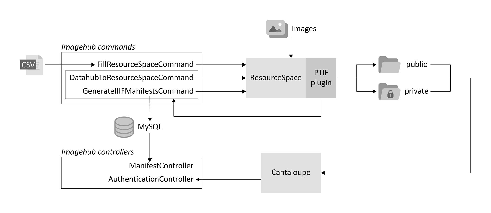

# Imagehub

## Project overview



The Imagehub provides a link between [ResourceSpace](https://www.resourcespace.com) and the [Datahub](https://github.com/thedatahub/Datahub). Resources uploaded in ResourceSpace 

## Requirements

The Imagehub installation requires all of the following components:

* PHP >= 7.1
* MySQL or MariaDB
* Apache or NGinx

The following components may be installed on either the same or a different server than the one containing the Imagehub:
* [ResourceSpace](https://www.resourcespace.com/get) >= 9.1 with the [RS_ptif](https://github.com/kmska/RS_ptif) plugin installed
* [Cantaloupe](https://cantaloupe-project.github.io/) >= 4.1

If authentication is required to access certain resources (for example images that are only meant for internal use), you also need the following:
* Active Directory Federation Service on your local network
* The [Cantaloupe delegate script](https://github.com/kmska/cantaloupe_delegate) set up in your Cantaloupe installation folder

## Preparation

Your ResourceSpace installation requires a specific set of metadata fields. You can set this up by using the resourcespace_metadata_fields.sql file included in this project, this will drop and recreate the resource_type_field table.<br/>
Certain metadata fields, most notably dropdown lists (for example Publisher and Cleared for usage) need to be prefilled with the necessary values before adding resources. This can be done either manually through the admin console of ResourceSpace or by using the resourcespace_node_values.sql included in this project.

An appropriate database should be created containing a table 'iiif_manifest' according to the following structure:
```
CREATE TABLE `iiif_manifest` (
  `id` int UNSIGNED NOT NULL AUTO_INCREMENT,
  `manifest_id` varchar(255) NOT NULL,
  `data` longtext NOT NULL,
  PRIMARY KEY (`id`)
);
```
A MySQL user is to be created with full access to this table. The username, password and database name can be freely chosen and are configured in the .env file in this repository.

## Installation

Clone this repository:
```
git clone https://github.com/kmska/ImageHub.git Imagehub
```

Edit any values according to your local setup in .env and config/imagehub.yaml. At the very least, the following values should be checked and edited where needed:
In .env: 
* DATABASE_URL=mysql://(user):(pass)@(host):(port)/(db_name)

In config/imagehub.yaml:
* Values necessary
- resourcespace_api_url
- 


Install the Imagehub through [composer](https://getcomposer.org/):
```
cd Imagehub
composer install
```

